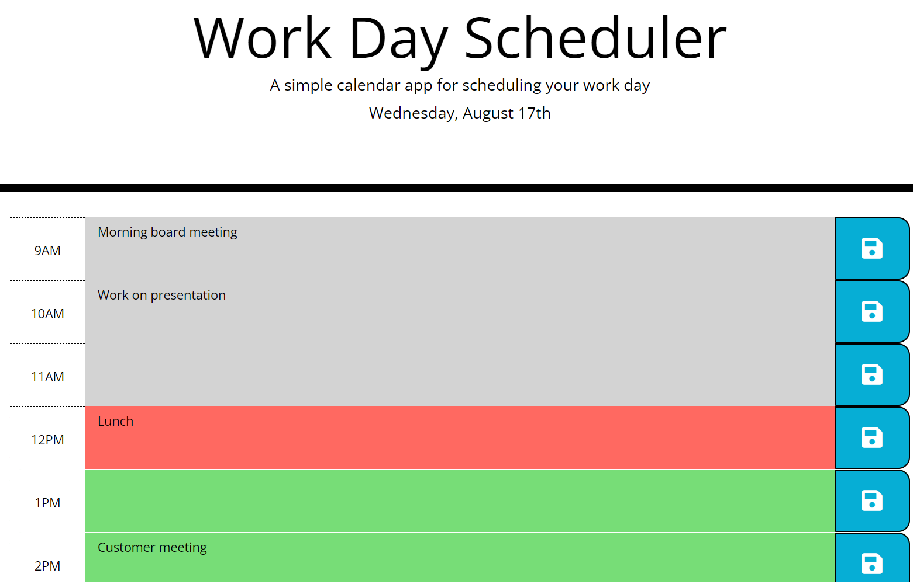

# Work-Day-Scheduler
## Description
This is a virtual calendar/to-do list for work hours. It shows you the current day and date and has hourly time blocks for a standard 9-5pm work day. Hour blocks for time that has passed are grey while the time block for the current hour is red and the time blocks for future times are green. Simply enter your task into the large text area and click the save button to save it. Even if you reload the page or accidently exit from it and have to open it again, your tasks will still be right where you typed them! To edit a task, simply change it in the text area and save it again!
## Purpose
To help the user organize their workday by mapping out what needs to be done each hour of the work day.
## Built With
- HTML
- CSS
- Javascript
- Jquery
- Moment.js
## Demo
### Deployed link: https://ella9894.github.io/Work-Day-Scheduler/

## Contact
Made by Gabriella Akpojiyovwi Inc. 

